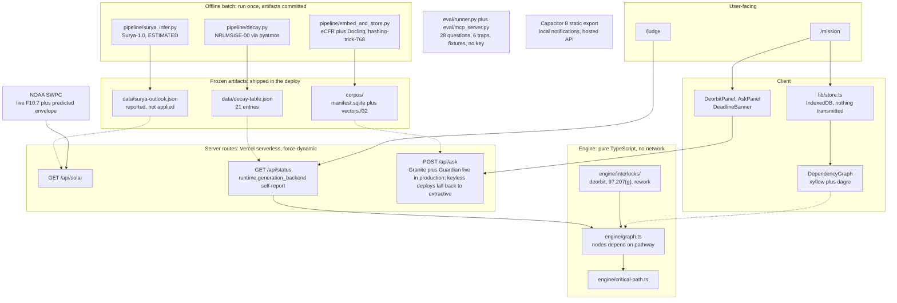
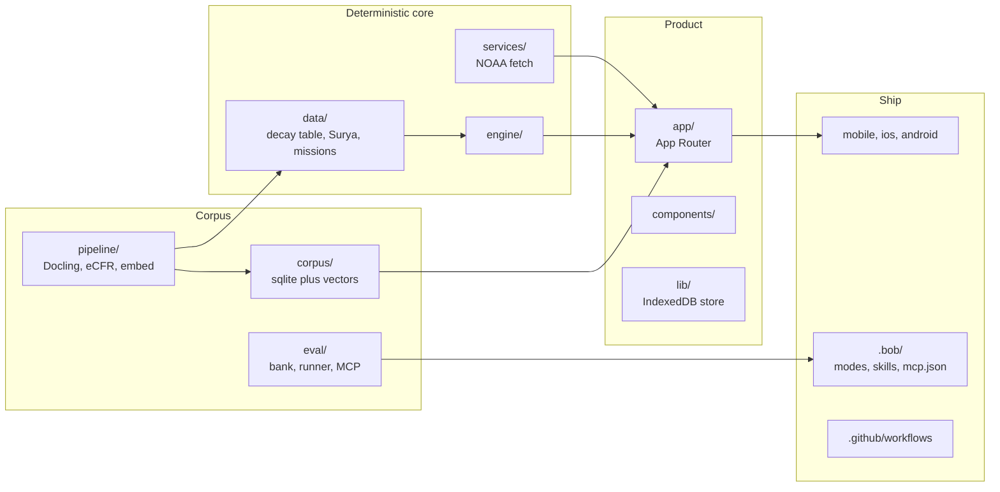

# Manifest

**Regulatory critical-path planner for US university CubeSat missions.**

> "The sun decides whether your satellite's orbit is legal. Manifest is the first launch-licensing planner that knows it."

[](https://github.com/StephenSook/manifest/actions/workflows/ci.yml)
[](https://github.com/StephenSook/manifest/actions/workflows/eval-gate.yml)
[](engine/)
[](LICENSE)
[](https://aibuilderschallenge-bobhub.bemyapp.com/)

Built for the **IBM AI Builders Challenge August 2026**, theme: Advance Space Exploration with AI.

---

## Judge Quick Access

No account. No keys. Every claim below is either a live link or a `grep` command.

| To verify... | Go here |
|---|---|
| **Try it, zero setup** | [manifest-web-roan.vercel.app/judge](https://manifest-web-roan.vercel.app/judge): numbered walkthrough. [/mission](https://manifest-web-roan.vercel.app/mission): the planner |
| **The headline, recomputed live** | [manifest-web-roan.vercel.app/api/status](https://manifest-web-roan.vercel.app/api/status): unauthenticated, recomputes the violated-days number on every request and self-reports the wired models |
| **The differentiator** | [`engine/interlocks/deorbit-compliance.ts`](engine/interlocks/deorbit-compliance.ts) + [`data/decay-table.json`](data/decay-table.json) -- same orbit, opposite verdict, solar cycle decides |
| **128 engine and mobile tests passing** | `npm install && npm run test:engine` |
| **The eval suite, offline** | `python3 eval/runner.py --mode fixtures` -- 28 questions + 6 abstention traps, no network, no key |
| **Claims are wired, not aspirational** | `grep -r "ibm/granite" app/ pipeline/` -- every named model has an import or call |
| **IBM Bob is committed and inspectable** | [`.bob/custom_modes.yaml`](.bob/custom_modes.yaml), [`.bob/mcp.json`](.bob/mcp.json), [`docs/bob-evidence/`](docs/bob-evidence/) |
| **Honesty live** | `/api/status` -- unauthenticated, self-reports which models are actually running |
| **The live solar reading** | [manifest-web-roan.vercel.app/api/solar](https://manifest-web-roan.vercel.app/api/solar): unauthenticated, reads NOAA SWPC on every request. Cross-check `f107_live` against [NOAA's own endpoint](https://services.swpc.noaa.gov/products/summary/10cm-flux.json) |
| **Reproduce the decay table** | `uv sync --python 3.12 --project pipeline && pipeline/.venv/bin/python3 pipeline/decay.py`. Writes `data/decay-table.json` from a real NRLMSISE-00 integration. No keys |

---

## Problem Statement

<!-- Populated after FACTS.json is generated by scripts/facts.py from a real engine run.
     Every number in this section must come from docs/FACTS.json. -->

University CubeSat programs face a multi-agency licensing campaign spanning IARU coordination, ITU filing, FCC licensing, and (for imaging missions) NOAA remote sensing approval. These dependencies form a critical path against an immovable launch date. Miss one, and the launch provider demanifests the satellite.

What no planning tool tells a university team: the same satellite in the same orbit can be FCC-compliant or non-compliant depending on where the solar cycle sits across the mission life. Atmospheric drag, driven by solar activity, determines whether a CubeSat reenters within the FCC's five-year post-mission-disposal requirement. A 3U at 550 km near solar maximum reenters well within five years. Near solar minimum, the same orbit can exceed the limit. The team that does not know this files a compliant application and discovers the problem at the FCC, not in their planning tool.

Manifest surfaces that constraint as a node in the dependency graph: a deorbit compliance verdict that becomes a hard prerequisite of FCC grant. The verdict is computed from an NRLMSISE-00 ballistic drag integration across NOAA's own solar-minimum and solar-maximum flux bounds, and the live NOAA reading is served and cross-checkable at `/api/solar`. Every regulatory claim is grounded in a versioned citation to the governing text. If the corpus cannot support an answer, Manifest says exactly what is missing.

---

## Solution Description

<!-- Populated from docs/FACTS.json after a real engine run. -->

Manifest models the CubeSat licensing campaign as a dependency graph against a fixed launch date. Enter your mission parameters: launch date, launch-vehicle determination date, integration date, regulatory pathway (Part 97 amateur, Part 5 experimental, or Part 25), frequencies, whether the mission images Earth, and orbital altitude. The engine computes the backward critical path and surfaces every violated or at-risk constraint.

Six interlocks fire on real regulatory requirements:

1. **97.207(g) dual clock**: pre-space notification due within 30 days after launch-vehicle determination and no later than 90 days before integration.
2. **FCC waits for NOAA**: imaging missions require the NOAA CRSRA license as a hard predecessor of FCC grant.
3. **IARU before Part 97**: the IARU coordination letter is a practical prerequisite of the amateur pathway.
4. **ITU API before FCC grant**: ITU advance publication filing is a 2 to 3 month prerequisite.
5. **Delivery is the wall**: the launch provider's delivery date is a hard terminal deadline. Late licensing means demanifest.
6. **Re-work triggers**: frequency change forces IARU re-coordination; orbit above approximately 600 km forces a propulsion or drag decision under the FCC five-year rule; launch slip recomputes every clock.

The deorbit compliance verdict is computed by an NRLMSISE-00 orbital lifetime integration evaluated across NOAA's published solar-minimum and solar-maximum flux bounds, which is what produces the opposite verdicts for one orbit. The current NOAA SWPC F10.7 reading and the forward predicted-flux envelope are fetched live and served at `GET /api/solar`, where IBM and NASA's Surya activity index is reported alongside them and labelled ESTIMATED. Surya is reported for context, not applied to the envelope.

---

## AI Approach and Architecture

<!-- This section describes only what /api/status self-reports.
     Do not add any model or tool that is not returning 200 in the running deployment. -->

**Generation:** `ibm/granite-4-h-small` on watsonx.ai (Lite plan, us-south region), wired in `app/api/ask/route.ts` and invoked whenever `WATSONX_API_KEY` and `WATSONX_PROJECT_ID` are present. Those credentials are set on the production deployment, and `/api/status` reports `generation_backend: watsonx`, `guardian_audit: active`. **Read those two as configuration, not as health**: they are derived from credential presence, which is why `/api/status.runtime.basis` now labels them `credentials-present (not a health check)`. The request that settles it is `POST /api/ask`, which reports `degraded: true` and names the upstream error whenever watsonx is unreachable.

**Embedding is the honest exception, and this README previously got it wrong.** `embedding_backend` is `hashing-trick-768`, not watsonx, in every deployment including this one. The route selects its embedder from the committed corpus freeze (task 1.3), so the watsonx embed call is unreachable in production. `ibm/granite-embedding-278m-multilingual` stays in the model inventory as what the pipeline is wired for, and the runtime block says what actually ran.

**Which path is answering right now is a question for the endpoints, not for this file.** `POST /api/ask` reports `degraded` on every response that attempted an answer, and names any upstream error. The abstention responses (an empty question, a matched abstention trap, a Guardian rejection) omit it deliberately, because no generation was attempted and a degradation flag there would assert something the request never tested, and `GET /api/status` reports the configured backends with the basis for each. Those answer at the moment you ask, which is the whole reason they exist, and this README will not try to out-guess them.

For the record, because a dated incident is worth more than a claim of steadiness: on 2026-08-29 the account's watsonx Lite token quota was reached, generation returned HTTP 403, and production degraded to the extractive path over the same corpus with cite-or-abstain enforced and Guardian not running. Keyless environments, including CI and any fresh clone, take that same path by design. Configured against running is one unauthenticated request to diff, and this README says which is which rather than leaving a reader to assume.

**Audit:** `ibm/granite-guardian-3-8b` reviews every citation-bearing answer for groundedness before display. An answer that fails the audit degrades to abstention with the retrieved source sections shown. Abstention is a designed state, not an error.

**The honesty rule, quoted verbatim from the shipped prompt** (`app/api/ask/route.ts`), so it is inspectable without opening code:

> You are a regulatory assistant for US CubeSat licensing. Answer only from the provided context.
> Every claim must cite the exact CFR section and paragraph (e.g., 47 CFR 97.207(g)(1)). If the context does not support an answer, say "I cannot answer from the provided regulatory text."

Any generated answer whose CFR references fail to resolve against the retrieved sections by exact section-plus-path match is converted to abstention before it ships.

**Retrieval:** `ibm/granite-embedding-278m-multilingual` over a precomputed brute-force cosine index. The corpus ships as a frozen SQLite bundle plus Float32 vectors, built by `pipeline/embed_and_store.py`, **committed to this repository and traced into the deployed function** by `outputFileTracingIncludes`. It is not fetched from a service at runtime. Vercel Blob is an optional overlay for a later Granite re-embed whose bundle would be too large to commit, and `/api/status` reports which source actually loaded. Until watsonx credentials land, the freeze uses IDF-weighted hashing-trick vectors with the identical transform on both corpus and query side.

**Solar outlook:** `nasa-ibm-ai4science/Surya-1.0` (IBM and NASA heliophysics foundation model, Apache-2.0, checkpoint `surya.366m.v1.pt`), run locally with a real forward pass over NASA SDO benchmark frames. Its activity index is a scalar proxy for near-term flare-associated EUV activity. Output is a frozen artifact at `data/surya-outlook.json`, served by `GET /api/solar` alongside the live NOAA reading and labelled ESTIMATED (D7). If it is absent the endpoint returns `surya_absent: true` rather than substituting a value. **It is reported for context and is not applied to the envelope or to the verdict**: no code adjusts a NOAA number using it, and saying otherwise would be a claim the shipped code does not support.

**Live solar reading:** `GET /api/solar` fetches NOAA SWPC's 10cm flux summary and its published predicted-flux envelope on every request, with no key and no cache, and reports the source URLs so the reading is cross-checkable against NOAA directly. If NOAA cannot be reached it returns `f107_live: null` and `solar_source: NOAA_UNREACHABLE` with the upstream failure text. No nominal value is ever substituted for a measurement nobody took.

**What computes the deorbit verdict, stated precisely.** The compliance verdict on `/api/status` is computed from `data/decay-table.json`, a real NRLMSISE-00 ballistic drag integration (pyatmos 1.2.7, King-Hele/Low 2018) carrying per-row provenance and the F10.7 value each row assumed. It is a frozen physics run, not a live recomputation, and the solar-minimum and solar-maximum bounds in that table are what produce the opposite verdicts. `/api/solar` reports the live inputs and their provenance beside it. Two endpoints, two jobs, and neither claims the other's.

**Local rehearsal, and what it is not.** Development rehearsal used Ollama `granite4.1:8b` and `granite-embedding:278m` locally to keep watsonx tokens for the live demo. That is a workflow habit, not a shipped code path: grep this repository for `ollama` and you will find prose and one inventory string, no client and no call. The fallback the product actually ships is the offline extractive path over the committed corpus, which needs no model at all and is what answers when watsonx is absent or unreachable.

**Token budget, and the day it ran out.** watsonx Lite meters 300,000 tokens per month at 2 requests per second. The design spends as little of that as possible: the corpus is embedded offline into a frozen committed index, so production never pays a cold-start reindex; the CI eval runs against committed fixtures with no key at all; rehearsal happened locally; and each live watsonx run is a deliberate, dated event recorded in `docs/FACTS.json` (`eval_live`).

It was not enough. On 2026-08-29 the account's monthly ceiling was reached, generation began returning HTTP 403, and production degraded to the extractive path. The honest lesson is that a metered free tier is a scheduled outage, not a budget, and the deliberate live eval runs that produced the published `eval_live` figure are themselves part of what spent it. What the design did buy is that the product kept answering with real citations through the outage instead of going down, and said so in every response. Whether the account is above or below that ceiling on the day you read this is reported by the two endpoints named above, not asserted here.

**Corpus:** Title 47 Parts 5, 25, 97 and Title 15 Part 960 from eCFR bulk XML (govinfo.gov), plus FCC-26-47A1.pdf, FCC-22-74A1.pdf, the NASA DAS 3.2 User Guide (cited as authority, not a DAS run), and NASA CubeSat 101 (2017, age flagged). NASA-STD-8719.14C sits behind the NASA Technical Standards login wall and is deliberately not ingested; questions about it abstain with a pointer. Every chunk carries its snapshot AMDDATE. Part 100 (FCC 26-47, adopted July 22, 2026) is ingested separately and tagged PENDING regime: the effective date has not been announced, and Part 25 remains binding today.

**Eval:** 28-question bank plus 6 abstention traps with exact-citation scoring (`eval/runner.py`). Runs in CI on every push against committed fixtures (no network, no key), with a raise-only regression floor and a hard requirement that every abstention trap abstains. Current honest baseline on the credential-free extractive path: 53.6 percent with 6/6 traps abstaining (2026-08-26). The full watsonx pipeline (Granite generation plus Guardian audit) was measured against production on 2026-08-29: the full suite scored 7.1 percent, with all 6 traps abstaining and zero fabricated citations. The Guardian audit rejects most generated answers rather than ship an ungrounded citation, so the pipeline fails closed instead of scoring points, and the measured number is published in `docs/FACTS.json` (`eval_live`) beside the runtime that answered. The 90 percent bar from our own spec was not met, and this paragraph says so rather than hiding the run.

**Eval as an MCP tool:** `eval/mcp_server.py` exposes `run_eval` and `eval_last_report` over MCP, wired into `.bob/mcp.json` so IBM Bob invokes the regression suite during development.

### Architecture, wired paths only

Designed artifact: [`docs/architecture.svg`](docs/architecture.svg). The mermaid below is the same map in a form GitHub renders. Every edge is a path that exists in the shipped tree. Cut surfaces (timeline view, web push, Context Forge gateway) are named in Known Limitations, not drawn as if they run.



Solid arrows are per-request. Dashed arrows are committed artifacts, read at startup or statically imported. The engine never calls Python at runtime. `/api/ask` is extractive on the current deploy; `/api/status.runtime` is the check.

### How IBM Bob Was Used

<!-- Build-trace table and evidence populated as features land. Updated after each phase boundary. -->

IBM Bob 2.0.3 is the primary development tool (competition requirement). The `.bob/` directory is committed and inspectable: the write-scoped modes, skills, MCP config, and the evidence trail are all in the repo and machine-checkable.

**Evidence locations:**

| Artifact | Location |
|---|---|
| Generated attribution table, counts computed from the repo | [`docs/bob-evidence/ATTRIBUTION.md`](docs/bob-evidence/ATTRIBUTION.md) |
| Custom modes (5, write-scoped) | `.bob/custom_modes.yaml` |
| Workspace skills | `.bob/skills/` |
| Workspace MCP config | `.bob/mcp.json` |
| Bobalytics screenshots (subscription usage) | `docs/bob-evidence/bobalytics-01.png`, `bobalytics-02.png`, `bobalytics-03.png` |
| Bob settings, in-editor usage meter | `docs/bob-evidence/bob-usage.png` (Bob 2.0.3, third team member, budget exhausted) |
| Plan-mode output (freeze critical path) | [`.bob/plans/freeze-critical-path.md`](.bob/plans/freeze-critical-path.md), genuine Bob Plan-mode output, provenance confirmed by its author 2026-08-29 |
| Plan-mode session (build critical path) | Never captured. Honesty log: [`docs/bob-evidence/plan-mode-critical-path.md`](docs/bob-evidence/plan-mode-critical-path.md) |
| Lane enforcement | [`docs/bob-evidence/lane-enforcement.md`](docs/bob-evidence/lane-enforcement.md) (shipped fileRegex, git event, CI test). Not a pasted Bob chat. |
| Engineering log (what went wrong, and what caught it) | [`docs/ENGINEERING-LOG.md`](docs/ENGINEERING-LOG.md): 14 dated defects this project shipped, each citing a commit. Opens with the three the AI-assisted work introduced. |

The Plan-mode row is an honesty log because the session was never exported. Inventing a transcript would be worse than the gap. Lane enforcement is a property of `.bob/custom_modes.yaml`: `frontend` cannot write `docs/architecture.svg`, `evidence-writer` can. `tests/test_bob_lane_enforcement.py` asserts that table on every CI run.

**Measured Bob spend, three separate subscriptions.** Each figure is legible in the screenshot named beside it, so none of this rests on our word:

| Subscription | Measured | Source |
|---|---|---|
| Member 1, upgraded from Trial to Pro | **60.24** Bobcoins spent against a 40.00 budget, 20.24 of it billable overage; budget renews 2026-09-12 | `bobalytics-02.png` (earlier state, 40.13 on Trial, in `bobalytics-01.png`) |
| Member 2, Trial | **40.39** Bobcoins against a 40.00 budget, reported as -1 percent remaining, 6 days left on the trial | `bob-usage.png` |
| Member 3, Trial | **19.141 of 40 units, 48 percent**, contract period 2026-08-05 to 2026-09-04 | `bobalytics-03.png` |

Two of the three budgets are exhausted and one crossed into paid overage. Note the two consoles label the meter differently: Bobalytics reports Bobcoins, the IBM SaaS console reports units, and this README does not assert they are the same unit, so the three figures are listed separately rather than summed into a single team number.

Account identifiers are redacted from these screenshots. The usage figures, plan tiers, dates and the Bob version string are untouched, because those are the evidence.

**Five write-scoped custom modes** restrict Bob's write access to each team member's lane:

| Mode | Lane | fileRegex scope |
|---|---|---|
| `regulatory-engine` | Engine, eval, solar, data, scripts, status/solar routes, decay/surya | engine, eval, services, data, scripts, pipeline decay/surya, `/api/status`, `/api/solar`, tests except e2e |
| `corpus-engineer` | Corpus, ask, pipeline except Stephen's three files | corpus, `/api/ask`, pipeline minus decay/surya/test_decay |
| `frontend` | App except api, components, lib, public, sw, e2e | `app/` except `api/`, components, lib, public, `sw.ts`, `tests/e2e/` |
| `mobile-shell` | Capacitor, iOS, Android | mobile, android, ios, `capacitor.config.ts`, `next.config.mobile.ts` |
| `evidence-writer` | Docs, README | `docs/`, `README.md` |

**Human/AI boundary:** Bob authored code within these scoped sessions. The team made all architectural and product decisions: the deorbit-compliance-as-legal-verdict framing, the cite-or-abstain policy, the decision to serve Surya as a frozen artifact beside the NOAA envelope rather than apply it to the verdict, and all citations and numbers. Bob does not decide whether a regulatory claim is correct; humans do, backed by primary sources.

**Engineering incident log.** Four dated events from the Bob workflow, each checkable in this repo without opening Bob:

- **2026-08-24, the eval bank became a Bob tool.** `eval/mcp_server.py` exposes `run_eval` and `eval_last_report` over stdio and `.bob/mcp.json` points Bob at it, so Bob can score its own edits against the 28-question bank plus 6 abstention traps during development (commit `82cecca`). The IBM Context Forge gateway registration is parked: the virtual-server create call returned an opaque error, so this README claims the stdio wiring only. Claiming the gateway before it answers would be an unwired claim.
- **2026-08-25, the lane split fired on a real write.** Frontend mode refused `docs/architecture.svg` because the path does not match that mode's `fileRegex`; the author switched to `evidence-writer` and the diagram landed inside that scope (`git show e6788e5`, `git show 377a146`). The chat was not exported, so the durable record is the property itself: `tests/test_bob_lane_enforcement.py` asserts the allow/refuse table on every CI run, and widening `frontend` to include `docs/` fails the build.
- **2026-08-26, Orchestrator mode does not exist, verified rather than assumed.** Bob 2.0.3 offers Agent, Plan and Ask plus the five workspace modes. A grep over the installed app bundle found `orchestrator` only inside TypeScript's own compiler files. The evidence above therefore claims lane enforcement, not an Orchestrator session.
- **2026-08-26, the Plan-mode gap stayed a gap.** The build's critical-path Plan session was never exported. [`docs/bob-evidence/plan-mode-critical-path.md`](docs/bob-evidence/plan-mode-critical-path.md) is the dated refusal to reconstruct it, because an invented transcript would be worse than the missing one. The freeze window is the exception that proves the discipline: [`.bob/plans/freeze-critical-path.md`](.bob/plans/freeze-critical-path.md) is genuine Plan-mode output, committed by its author and cited only after the author confirmed its provenance on 2026-08-29.

---

## Selected Challenge Theme

**Advance Space Exploration with AI**

Manifest advances space exploration by removing the licensing bottleneck that demanifests university CubeSat missions. The solar-weather connection is not decoration: solar activity is a real regulatory input. The FCC five-year disposal compliance verdict changes a satellite's legal status depending on where the solar cycle sits, the live NOAA reading behind it is served unauthenticated at `/api/solar`, and IBM and NASA's Surya activity index is reported beside it. Space weather enters a planning tool as law, not as a dashboard.

### Theme alignment, in the challenge's own terms

| The challenge asks for | Where Manifest does it | Check it yourself |
|---|---|---|
| **Advance space exploration** | Removes the regulatory failure that grounds finished university satellites. CubeSat 101 documents demanifest, including a deployer-disable near-miss, as the consequence of missing licensing by delivery. | `engine/graph.ts`, the `delivery` terminal node |
| **with AI** | Three IBM Granite models wired in `app/api/ask/route.ts`: generation, a Guardian groundedness audit, and embeddings. IBM and NASA's Surya heliophysics model contributes a real forward pass. | `grep -r "ibm/granite" app/ pipeline/` |
| **Built with IBM Bob as the core component** | Five write-scoped modes, four workspace skills, and the eval bank exposed to Bob as an MCP tool it can invoke during development. All committed. | `.bob/custom_modes.yaml`, `.bob/skills/`, `.bob/mcp.json` |
| **Solving a real-world problem** | A real multi-agency campaign, six interlocks written against 47 CFR and 15 CFR with section-level citations pinned to a dated snapshot. | `GET /api/status`, `python3 eval/runner.py --mode fixtures` |

---

## Known Limitations

Every item here is a deliberate scope decision, not an unknown. Naming them is cheaper than having a judge find them.

| Limitation | Why it is this way |
|---|---|
| **The watsonx path went live on production on 2026-08-29; every published eval score predates that and was measured on the credential-free extractive path.** | The Lite tier is metered at 300,000 tokens per month, so live watsonx runs are deliberate, dated events. `/api/status` reports which backend actually answered on every request, so the reader never has to take this row's word for it. The watsonx-path eval was run on 2026-08-29 and measured 7.1 percent, published in `docs/FACTS.json` (`eval_live`): the Guardian audit fails closed on most generated answers rather than ship an ungrounded citation. |
| **The eval scores 53.6 percent**, not the 90 percent bar in our own spec. | That is the credential-free extractive ceiling, measured and published rather than rounded up. CI enforces a raise-only ratchet at the measured floor and fails if any abstention trap answers. The number is in `docs/FACTS.json` because the runner puts it there. |
| **The deorbit verdict computes from a frozen NRLMSISE-00 table**, not a per-request physics run. | The table is a real integration with per-row provenance. Recomputing per request would move a judge-facing number without improving its accuracy. `/api/solar` serves the live inputs beside it. |
| **NASA-STD-8719.14C is not ingested.** | It sits behind the NASA Technical Standards login wall. Questions that need it abstain with a pointer rather than answering from a summary. |
| **Surya's activity index is ESTIMATED and is not applied to anything.** It is a scalar proxy from one forward pass over October 2014 benchmark frames. | It is not a calibrated X-ray flux value, and no code adjusts a NOAA number or the verdict using it. It is reported beside the envelope for context and labelled as such everywhere it appears. Earlier copy said it narrows the envelope; that was a claim the code did not support, and it has been cut rather than quietly implemented days before a freeze. |
| **Lead times are labelled DOCUMENTED or ESTIMATED**, and CubeSat 101's figures date to 2017. | Presenting folklore as fact is the failure mode this tool exists to prevent. The age is flagged wherever those figures are used. |
| **The timeline view and the citation panel are not built.** | Named here rather than implied by an architecture diagram. The dependency graph, the deadline banner and the Q&A surface are. |

---

## How Manifest Maps to the Judging Criteria

| Criterion | How Manifest earns it |
|---|---|
| **Technical Execution** | 128 engine and mobile tests passing (`npm run test:engine`). NRLMSISE-00 orbital lifetime integrator (pyatmos 1.2.7) producing real numbers committed to `data/decay-table.json`, and `/api/status` now reports which table row a verdict actually used when the orbit is off the grid. Six regulatory interlocks wired against 47 CFR and 15 CFR with citation paths. Granite generation and the Guardian audit run on watsonx; the Granite embedder is configured but unreachable because the committed corpus freeze picks the embedder, and `/api/status` self-reports all three. |
| **Innovation** | The only project in this field where space weather changes a legal outcome. At 550 km with Bc=180 kg/m^2: solar max lifetime 2.57 yr (FCC-compliant), solar min lifetime 15.0 yr (VIOLATED). Same orbit, opposite verdict -- the solar cycle decides. No planning tool has connected F10.7 to a regulatory determination before this. |
| **Challenge Fit** | Live NOAA SWPC F10.7 ingest. IBM/NASA Surya heliophysics model (`surya.366m.v1.pt` checkpoint, Apache-2.0) contributes a real forward pass, reported beside the envelope and labelled ESTIMATED. Solar activity is the regulatory input, not a dashboard: NOAA's own flux bounds decide the verdict, and the IBMxNASA model is reported beside them. |
| **Feasibility** | One-command reproduction: `npm install && npm run test:engine`. No credentials on the deterministic path. CI green. `data/decay-table.json` regeneratable in under 3 minutes from `pipeline/decay.py`. |
| **Real-World Impact** | University CubeSat teams who cannot afford licensing counsel. Roughly 40% of university CubeSat missions fail; late licensing is a documented demanifest cause. Metric: violated-deadline days, computed live by `/api/status`, sourced from `docs/FACTS.json`. |

---

## The Differentiator Proof

The differentiator is not claimed, it is computed. Run this:

```bash
pipeline/.venv/bin/python3 -c "
from pipeline.decay import _lifetime_years
# 3U CubeSat at 550 km, Bc=180 kg/m^2
print('solar min (F10.7=70):', round(_lifetime_years(550, 180, 70), 2), 'yr -- VIOLATED (>5yr rule)')
print('solar max (F10.7=200):', round(_lifetime_years(550, 180, 200), 2), 'yr -- OK (<5yr rule)')
"
```

Expected output:
```
solar min (F10.7=70): 15.0 yr -- VIOLATED (>5yr rule)
solar max (F10.7=200): 2.57 yr -- OK (<5yr rule)
```

Same orbit. Same satellite. Opposite legal answer. The solar cycle decides.
The engine encodes this as a deorbit compliance node that is a hard prerequisite of FCC grant.

---

## Real-World Impact

Manifest is for university CubeSat programs that cannot afford licensing counsel, where a schedule slip means the launch provider demanifests the satellite before the FCC license arrives.

The population, sourced: "it is not unusual for 40 university-class missions to fly every year," and "about 40% of all manifested university-class missions fail to achieve any of their primary mission objectives" (Swartwout and Jayne, "University-Class Spacecraft by the Numbers", 30th AIAA/USU Conference on Small Satellites, 2016, digitalcommons.usu.edu/smallsat/2016/TS13Education/1; figures date to 2016). NASA's CubeSat 101 (2017) budgets 4 to 6 months for regulatory licensing and notes the FCC requires a minimum of 90 days from application receipt, with IARU coordination starting immediately at manifest.

The need, from the field: a principal investigator at a US university CubeSat program told us in writing (August 2026, paraphrased and shared anonymously) that reconstructing his own mission's licensing chronology would require going back through all the filings, that his team slow-walked licensing steps while waiting for launch details to firm up, and that the FCC filing was only manageable because a NASA launch award paid a consultant to run it. Teams without that award are exactly who Manifest is for.

Every number in this section is sourced. Unsourced figures do not ship.

---

## Live Demo

- **Web app:** [manifest-web-roan.vercel.app/mission](https://manifest-web-roan.vercel.app/mission)
- **Judge page:** [manifest-web-roan.vercel.app/judge](https://manifest-web-roan.vercel.app/judge): numbered walkthrough, every claim reachable without login or key
- **Status API:** [manifest-web-roan.vercel.app/api/status](https://manifest-web-roan.vercel.app/api/status): unauthenticated, recomputes the headline number on every request, self-reports which models are running
### Install it on a phone

Scan from a phone camera, or tap the link. No account, no invite code, no tester limit.

| Platform | Install | Scan |
|---|---|---|
| **Web** (works everywhere, installable as a PWA) | [manifest-web-roan.vercel.app/judge](https://manifest-web-roan.vercel.app/judge) |  |
| **iOS** (TestFlight) | [testflight.apple.com/join/huQrZpek](https://testflight.apple.com/join/huQrZpek) |  |
| **Android** (signed APK, direct) | [`v1.0-beta.1` release asset](https://github.com/StephenSook/manifest/releases/download/v1.0-beta.1/manifest-v1.0-release.apk) |  |

iOS is Capacitor build 1.0 (1), **approved by Apple** in external Beta App Review on 2026-08-25; availability can lag briefly after a new build is uploaded, because Apple re-reviews. The Android APK is hosted as a **GitHub Release asset so the link does not expire**, unlike a build-service artifact with a retention window, and it is release-signed rather than a debug build. Firebase App Distribution is available as a second Android path.

---

## Mobile

The same engine ships as a native app (Capacitor 8 wrapping the Next.js static export, no server inside the WebView):

- **Local deadline notifications, no push server:** every future latest-start date in the computed critical path schedules an on-device alert (7 days, 1 day, day-of). iOS keeps only the soonest 64 pending requests, so the schedule is capped and resynced on every launch and resume. `mobile/schedule.ts` is pure and unit-tested.
- **Offline by design:** mission data persists to IndexedDB and the dependency engine runs on-device, so airplane mode is a working state, not an error. An offline strip says so.
- **Native navigation:** bottom tab bar with safe-area handling, Android hardware-back support.

Build it: `npm run build:mobile` then open `ios/App/App.xcodeproj` or `android/` in their IDEs.

---

## Repo Layout



```
/app                  Next.js App Router
/components           UI components
/engine               Dependency graph and critical path (pure TypeScript, unit-tested)
/corpus               Frozen corpus artifacts (SQLite, Float32 vectors, chunk JSON)
/pipeline             Python batch: Docling ingest, eCFR lxml parse, embedding build
/eval                 Eval bank (28 + 6), runner, MCP server (stdio, wired to IBM Bob)
/mobile               Capacitor variant config and native projects
/services             Solar data service (NOAA fetch, Surya interface)
/data                 Frozen artifacts: decay-table.json, surya-outlook.json, missions
/docs/bob-evidence    Bobalytics screenshots, lane-enforcement log, Plan-mode honesty log
.bob/                 Bob modes, skills, rules, mcp.json (committed)
.github/workflows     CI, eval gate, anti-fabrication guard, scheduled uptime content-check
```

---

## Running Locally

```bash
# Install dependencies
npm install

# Python pipeline (requires Python 3.12 via uv)
uv venv --python 3.12 pipeline/.venv
source pipeline/.venv/bin/activate
uv sync --python 3.12 --project pipeline

# Engine, mobile and ask-route tests
npm run test:engine
npm run test:ask

# Eval against the committed fixtures (offline, no key)
python3 eval/runner.py --mode fixtures

# Eval against a running server (uses whatever backend the server has)
python3 eval/runner.py --mode url --url http://localhost:3000

# Generate FACTS.json from a real engine run
python scripts/facts.py
```

One-command deterministic path (no credentials required):

```bash
npm install && npm run test:engine
```

---

## License

MIT. See [LICENSE](LICENSE).
